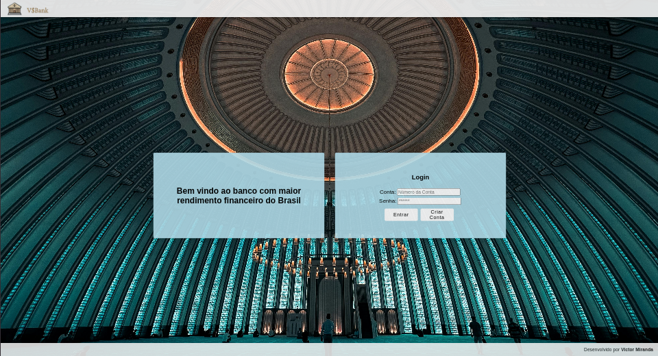
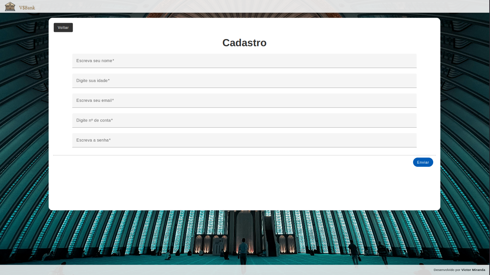
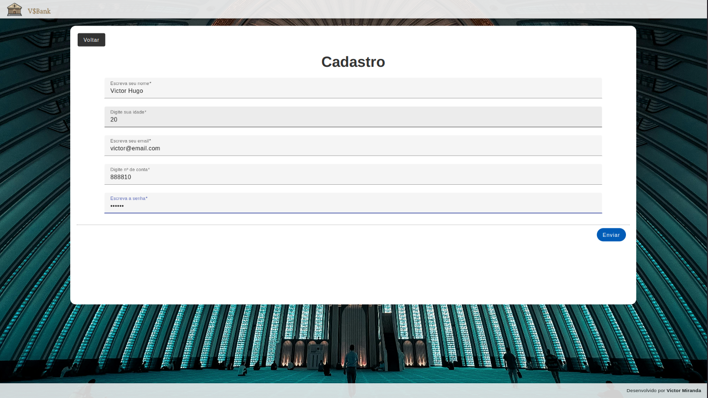
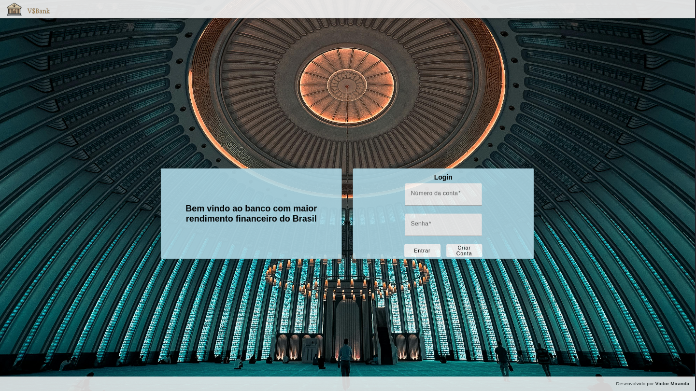
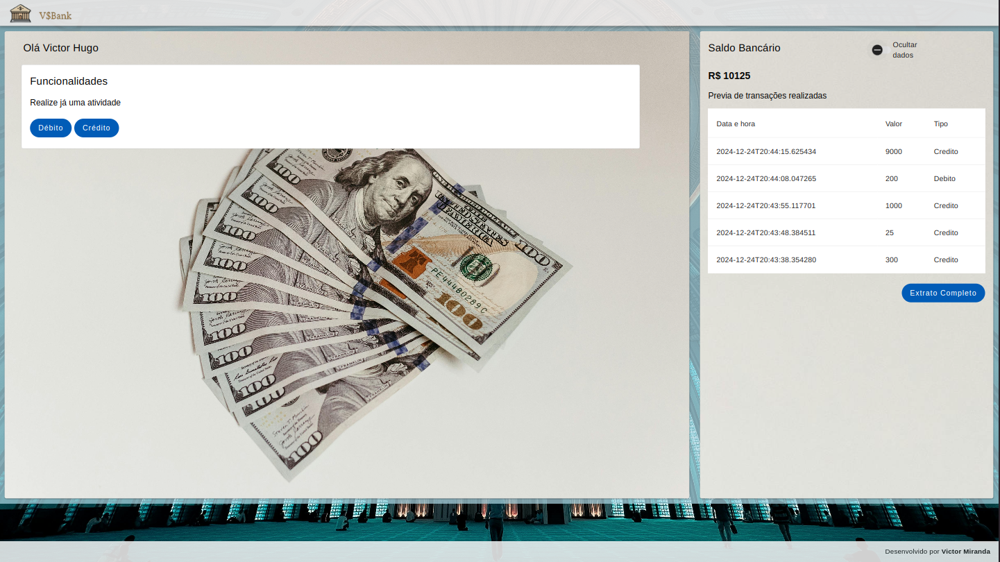
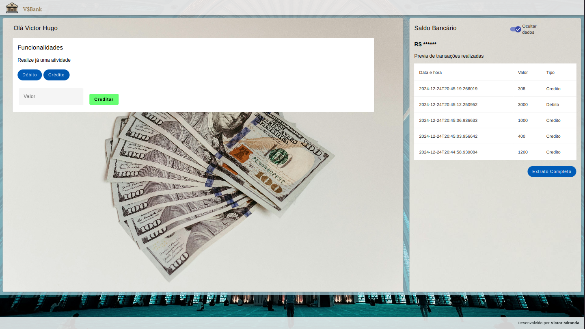
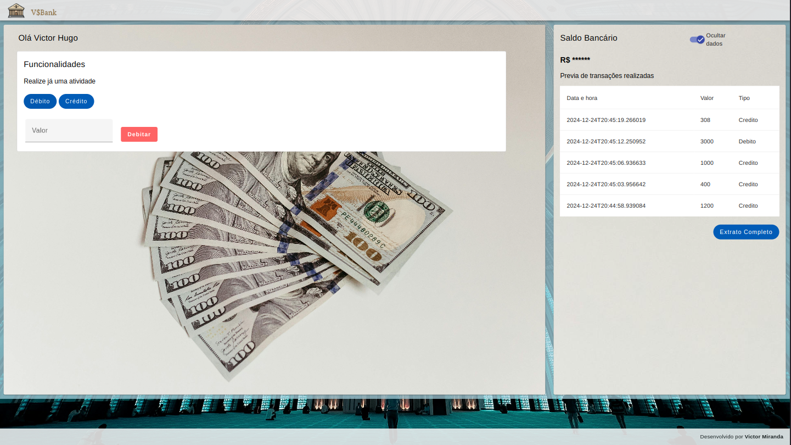
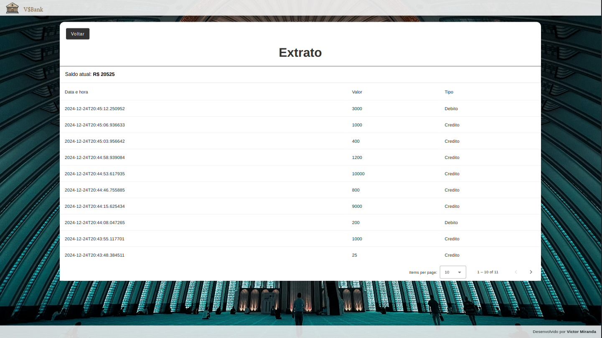

Projeto desenvolvido em Java 17 com SpringBoot 3.4.1, Angular 18 e PostgreSql 14.

A aplicação representa algumas atividades bancárias, como cadastro de cliente, transação de débito e crédito, além de ser possível visualizar informações as informações como o saldo e extrato.

O banco de dados está provisionado em ambiente cloud, sendo utilizando a plataforma Render https://render.com/.

Variáveis de ambiente para comunicação com o banco de dados:
DB_HOST=dpg-cthpdj3qf0us73dmjkfg-a.oregon-postgres.render.com
DB_NAME=db_financeiro
DB_PASSWORD=2vFqDEWPB8MNFz7QPCQ4GZlcpZb40PLb
DB_PORT=5432
DB_USER=app_financeiro

Diagrama de classes

Imagens do sistema:

